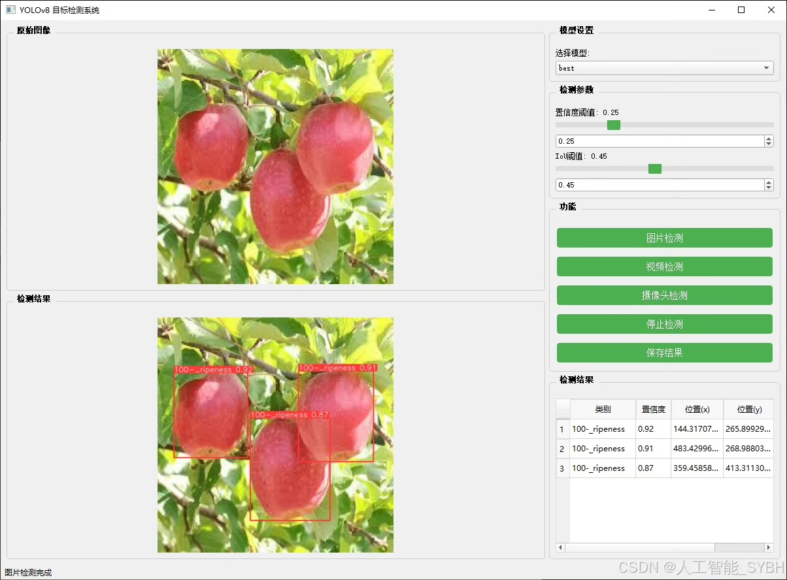
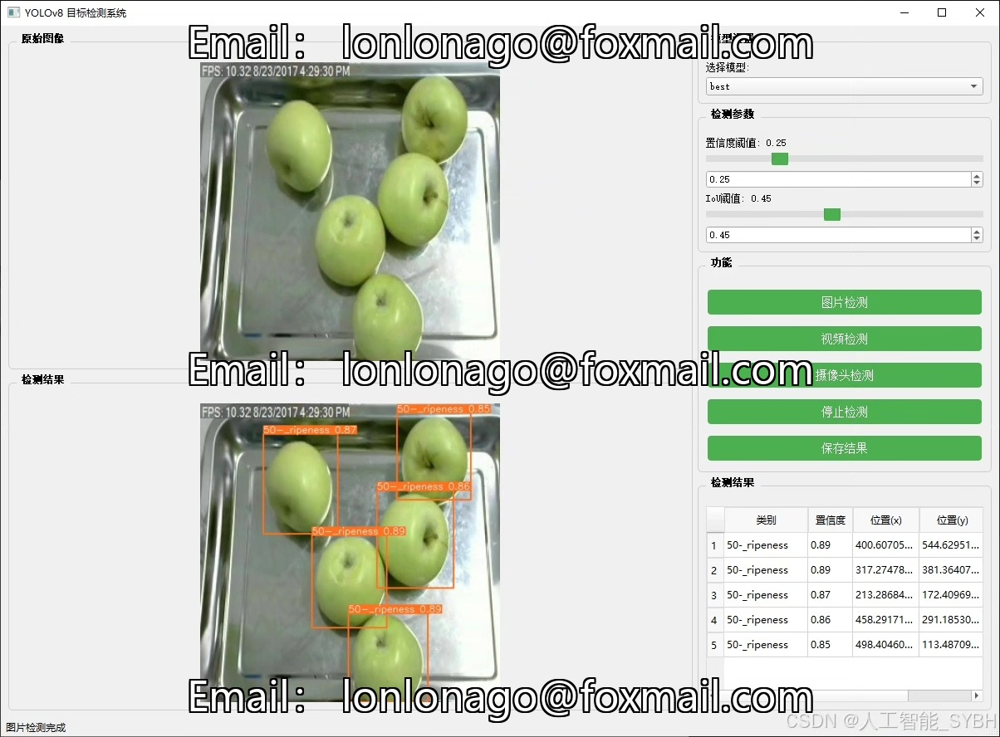
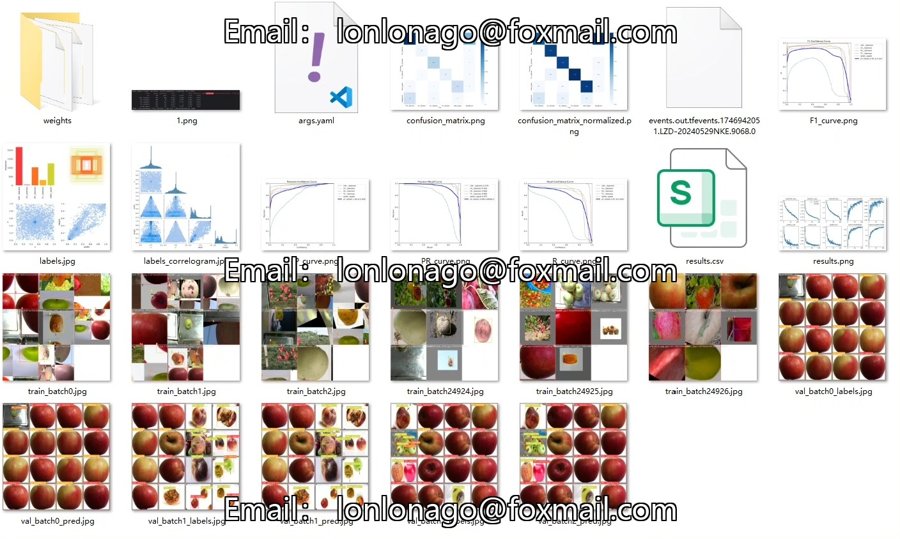
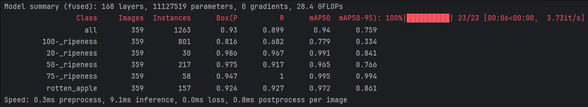
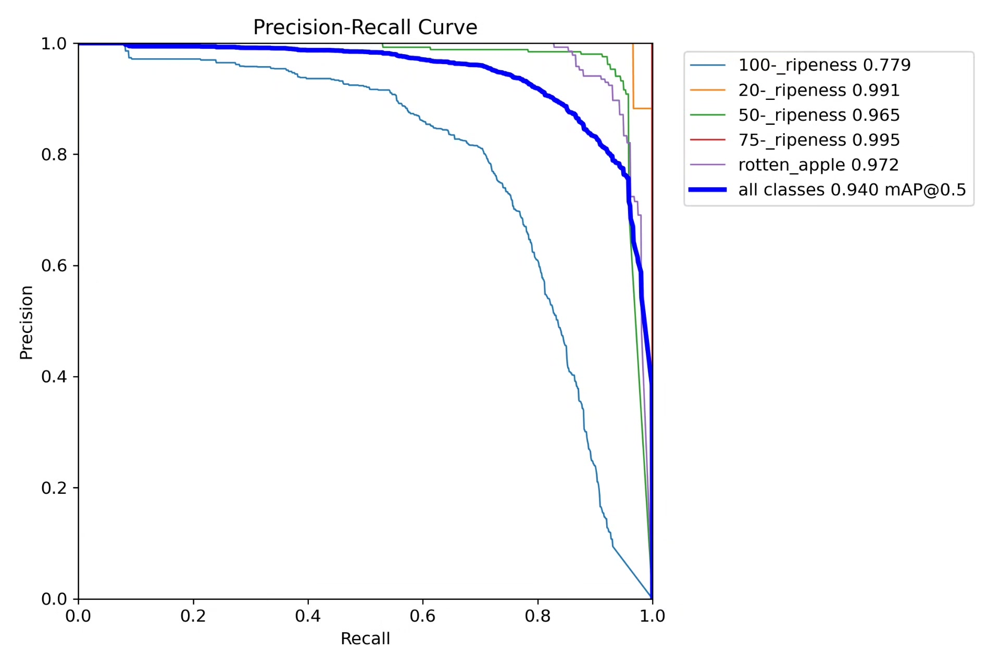
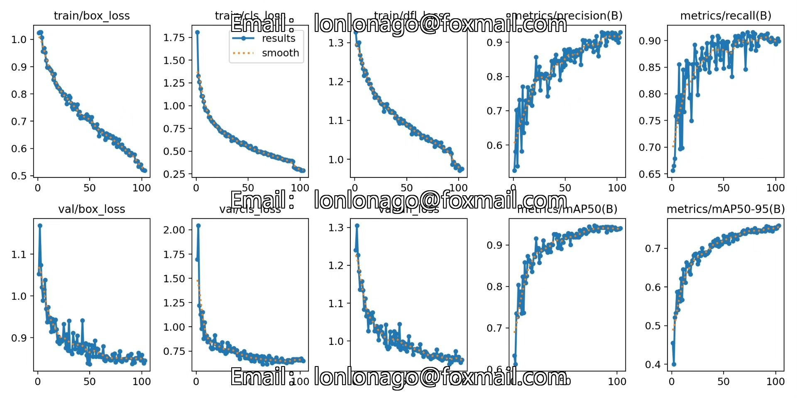
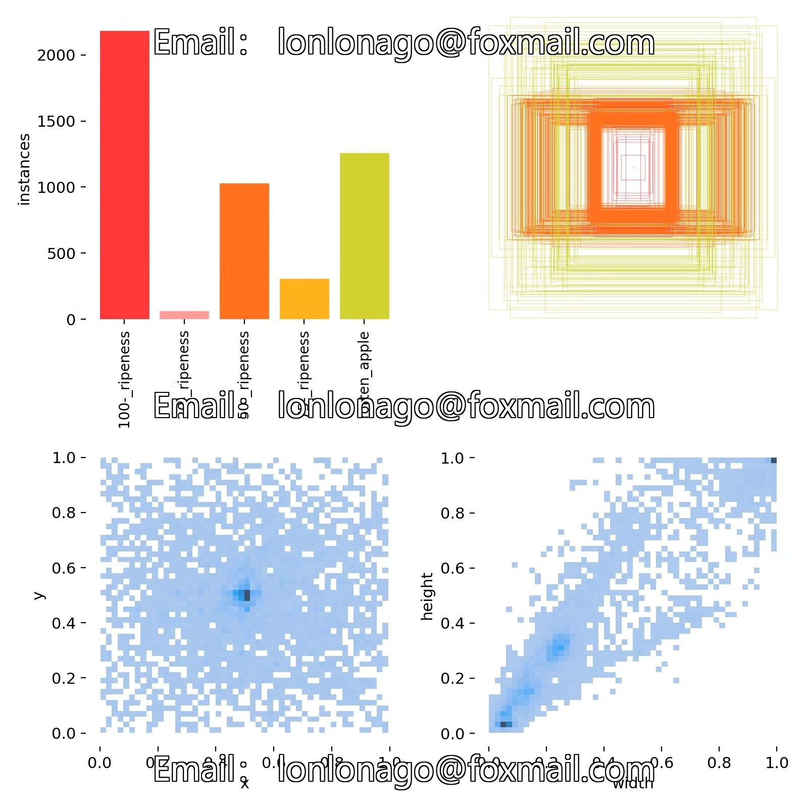
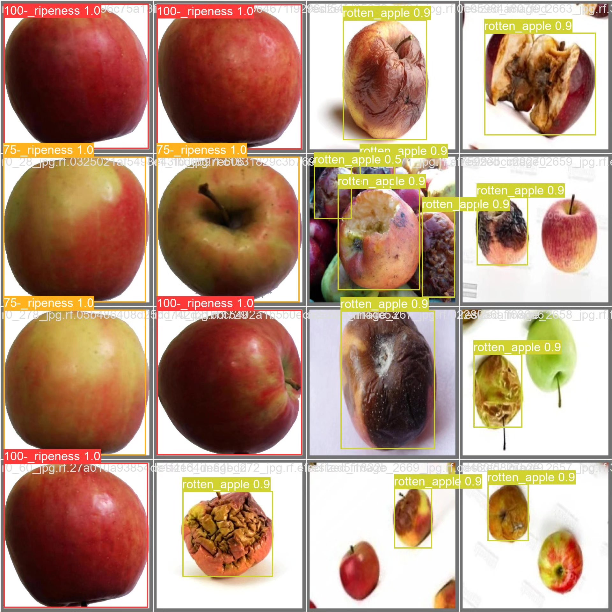

# Based on deep learning YOLOv8, an apple maturity detection system (YOLOv8+)

## Body

Based on the YOLOv8 object detection algorithm, this project has developed an automatic apple maturity detection system. It can accurately identify and classify five levels of apple maturity: 100% ripeness ('100-_ripeness'), 20% ripeness ('20-_ripeness'), 50% ripeness ('50-_ripeness'), 75% ripeness ('75-_ripeness'), and rotten apples ('rotten_apple'). The system is trained using a large professional dataset, including 2144 training images, 359 validation images, and 225 test images, ensuring the model's generalization ability and detection accuracy.

The company's products have obtained YOLO official commercial license certification.

We provide after-sales service.

After payment, we will provide WeChat ID for any questions.

Environment configuration: We will provide a tutorial on how to configure the environment, and WeChat will provide answers.

Remote installation service: If you need remote configuration, an additional fee of 69 is required, with all fees refunded if the configuration fails (only refunding installation fees for older computers).

Retraining dataset: After configuring the environment, you can train on your own computer. If you need us to retrain, just pay 69 plus computing power fees (2.5 yuan/hour).

Full after-sales service

## Images

## Payment

Here is a pay link on Stripe ( https://buy.stripe.com/3cs8yP7sY87d0vu9AB ). Please contact me lonlonago@foxmail.com after funding $89, and I will send you a complete data files , thank you!

